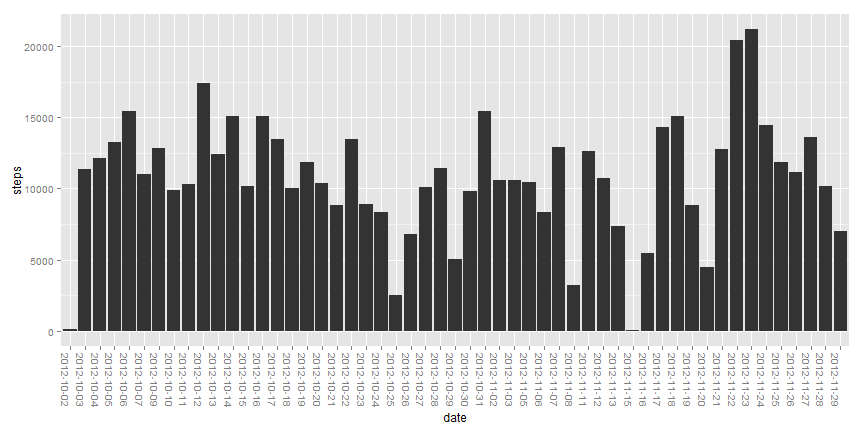
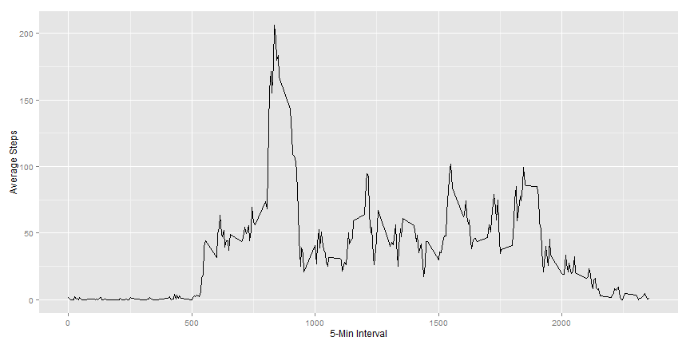
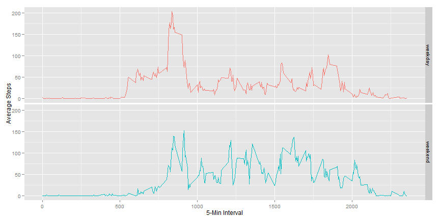

Reproducable Research: Peer Assessment 1
========================================================

It is now possible to collect a large amount of data about personal movement using activity monitoring devices such as a Fitbit, Nike Fuelband, or Jawbone Up. These type of devices are part of the "quantified self" movement - a group of enthusiasts who take measurements about themselves regularly to improve their health and find patterns in their behavior.

In this document, we will analyze and make sense of data collected from a personal activity monitoring device. This device collected data on **steps taken** at 5 minutes intervals throughout the day for two months (during the months of October and November in 2012).

Loading and processing the data
--------------------------------

Let's first load the dataset and get it into usable shape.


```r
#load data -- NOTE: change this to reflect your own working directory
setwd("F:/SkyDrive/UMD/Coursera/R-Explore/RepData_PeerAssessment1")
activity <- read.csv("activity.csv")

#load library
library("ggplot2")

#process columns to proper data type
activity$date <- as.Date(activity$date, format="%Y-%m-%d")

#create a new dataset that removes incomplete rows
activity.complete <- activity[complete.cases(activity),]

#create table of steps by day
activity.complete.byday <- aggregate(activity.complete$steps, list(date = factor(activity.complete$date)),sum)
names(activity.complete.byday)[2] <- "steps"
```

What is the mean total number of steps taken per day?
-------------------------------------------------------

Now, let's analyze the data so that we can assess trends and gain some insights. First, let's examine a histogram of the number of steps taken each day.


```r
chart.steps.byday <- qplot(y=steps, x=date, data=activity.complete.byday,geom="bar", stat="identity")
chart.steps.byday <- chart.steps.byday + opts(axis.text.x=theme_text(angle=-90))
```

```
## 'opts' is deprecated. Use 'theme' instead. (Deprecated; last used in version 0.9.1)
## theme_text is deprecated. Use 'element_text' instead. (Deprecated; last used in version 0.9.1)
```

```r
print(chart.steps.byday)
```

 

Let's also calculate the mean and medium steps taken on a daily basis.


```r
#calculate mean and median
mean(activity.complete.byday$steps)
```

```
## [1] 10766
```

```r
median(activity.complete.byday$steps)
```

```
## [1] 10765
```

What is the average daily activity pattern?
--------------------------------------------

Next, let's examine the average daily activity pattern by taking the average steps for each time interval across all days.


```r
#plot average number of steps by interval
activity.complete.byinterval <- aggregate(activity.complete$steps, list(interval=factor(activity.complete$interval)),mean)
names(activity.complete.byinterval)[2]<-"average.steps"

chart.steps.byinterval <- qplot(y=average.steps, x=as.numeric(as.character(interval)), data=activity.complete.byinterval, geom="line", stat="identity",ylab="Average Steps", xlab="5-Min Interval")
print(chart.steps.byinterval)
```

 

Let's identify the 5-minute interval with the largest average number of steps.


```r
#identify the interval with the maximum number of steps
activity.complete.byinterval[which.max(activity.complete.byinterval$average.steps),]
```

```
##     interval average.steps
## 104      835         206.2
```

Imputing missing values
------------------------
There are a number of days/intervals where there are missing values. The presence of missing days may introduce bias into some calculations or summaries of the data.

First, let's see how many missing values we have in the dataset.


```r
#calculate the total number of missing values in the dataset
sum(!complete.cases(activity))
```

```
## [1] 2304
```

Now, let's fill in estimates for these missing values using the mean for the particular interval across all days.


```r
#fill in the missing values by filling in the median for that time interval
activity.fixed <- activity
for (i in (1 : nrow(activity) ) ){
  if (is.na(activity[i,1])){
    intervalAverage <- activity.complete.byinterval[activity.complete.byinterval$interval == as.character(activity$interval),"average.steps"]
    activity.fixed[i,"steps"] <- as.numeric(as.character(intervalAverage[1]))
  }
}
```

Using this new dataset with the imputted missing values, we can now regenerate the histogram with the full dataset.


```r
#create table of steps by day
activity.fixed.byday <- aggregate(activity.fixed$steps, list(date = factor(activity.fixed$date)),sum)
names(activity.fixed.byday)[2] <- "steps"

chart.fixed.steps.byday <- qplot(y=steps, x=date, data=activity.fixed.byday,geom="bar", stat="identity")
chart.fixed.steps.byday <- chart.steps.byday + opts(axis.text.x=theme_text(angle=-90))
```

```
## 'opts' is deprecated. Use 'theme' instead. (Deprecated; last used in version 0.9.1)
## theme_text is deprecated. Use 'element_text' instead. (Deprecated; last used in version 0.9.1)
```

```r
print(chart.steps.byday)
```

 

We can also calculate the new average and mean and compare these against the values we calculated earlier.


```r
#calculate mean and median (and difference from earlier values)
mean(activity.fixed.byday$steps)
```

```
## [1] 9419
```

```r
mean(activity.fixed.byday$steps) - mean(activity.complete.byday$steps)
```

```
## [1] -1347
```

```r
median(activity.fixed.byday$steps)
```

```
## [1] 10395
```

```r
median(activity.fixed.byday$steps) - median(activity.complete.byday$steps)
```

```
## [1] -370
```

This demonstrates that the imputted values have **decreased** the estimates of the total daily number of steps.

Are there differences in activity patterns between *weekdays* and *weekends*?
------------------------------------------------------------------------------
To answer this question, let's create a new variable in the dataset to indicate whether the date falls on a weekday or a weekend.


```r
#create new variables: day of the week and day type (i.e. weekend or weekday)
activity.fixed$day <- weekdays(activity.fixed$date)
daytypes <- factor(c("weekday","weekend"))

activity.fixed$daytype <- daytypes[1] 

for (r in 1:nrow(activity.fixed)){
  if(activity.fixed[r,"day"]=="Saturday" | activity.fixed[r,"day"] == "Sunday") {
    activity.fixed[r,"daytype"] <- daytypes[2]
  }
}
#print out a table showing the distribution between weekdays and weekends
table(activity.fixed$daytype)
```

```
## 
## weekday weekend 
##   12960    4608
```

Using this new column, we can examine the difference in steps taken between weekdays and weekends.


```r
#calcluate the average steps taken for each interval, comparing weekdays to weekend days
activity.fixed.bydaytype <- aggregate(activity.fixed$steps, list(daytype = activity.fixed$daytype, interval = factor(activity.fixed$interval)),mean)
names(activity.fixed.bydaytype)[3] <- "average.steps"

# chart this data to demonstrate the different step patterns of weekdays vs. weekends
chart.steps.bydaytype <- qplot(y=average.steps, x=as.numeric(as.character(interval)), color=daytype, data=activity.fixed.bydaytype, geom="line", stat="identity",ylab="Average Steps", xlab="5-Min Interval")
chart.steps.bydaytype <- chart.steps.bydaytype + facet_grid(daytype ~ .) + theme(legend.position = "none")
print(chart.steps.bydaytype)
```

 
